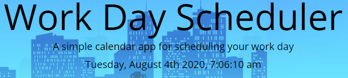
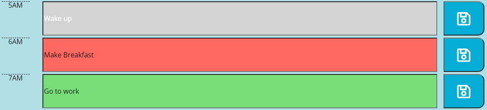

# Day-Planner
A day planner built with jQuery that allows users to add and edit events which are stored locally

## About
This is day planner is built using jQuery and utilizing moment.js to update the page based on the current date/time. User's can type events into each time slot and save them. These events are stored locally and allows the user to return while using the same device and see the stored events.

## Usuage
At the top of the page the current day, date, and time is displayed with moment.js and is updated in real time utilizing the ```setInterval()``` function.



To the left of the title is a 12 and 24 hour time format option. These buttons adjust the formatting of the live udated time at the top of the page and also the timeblocks. A darker blue denotes the selected time format.


There are 24 time blocks, one for each hour of the day, these are color coded to denote time blocks that have passed, the current time block, and future time blocks. Past are colored gray, current red, and future green. The user can click inside the colored input field to add and edit events. These events can be saved and stored locally by clicking the save button to the right of the time block.



## Credits

### Live Updating Time
To create the updating time I refered to dcode's video on YouTube, titled *Create a Digital Clock using Moment.js in JavaScript*. I shortened the code and implemented it to the page using jQuery however, dcode's method of seperating ```moment()``` from ```setInterval()``` was used to prevent delay of writing the time to the page when it is loaded or re-loaded.

https://youtu.be/KRnkXgbbpzY

## License
MIT License

Copyright (c) [year] [fullname]

Permission is hereby granted, free of charge, to any person obtaining a copy
of this software and associated documentation files (the "Software"), to deal
in the Software without restriction, including without limitation the rights
to use, copy, modify, merge, publish, distribute, sublicense, and/or sell
copies of the Software, and to permit persons to whom the Software is
furnished to do so, subject to the following conditions:

The above copyright notice and this permission notice shall be included in all
copies or substantial portions of the Software.

THE SOFTWARE IS PROVIDED "AS IS", WITHOUT WARRANTY OF ANY KIND, EXPRESS OR
IMPLIED, INCLUDING BUT NOT LIMITED TO THE WARRANTIES OF MERCHANTABILITY,
FITNESS FOR A PARTICULAR PURPOSE AND NONINFRINGEMENT. IN NO EVENT SHALL THE
AUTHORS OR COPYRIGHT HOLDERS BE LIABLE FOR ANY CLAIM, DAMAGES OR OTHER
LIABILITY, WHETHER IN AN ACTION OF CONTRACT, TORT OR OTHERWISE, ARISING FROM,
OUT OF OR IN CONNECTION WITH THE SOFTWARE OR THE USE OR OTHER DEALINGS IN THE
SOFTWARE.